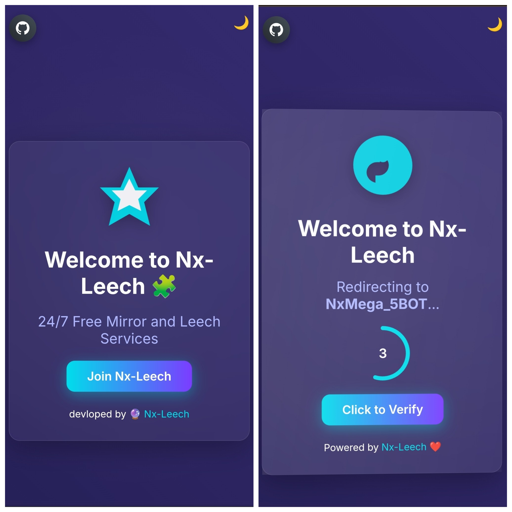

# Nx-Leech Redirect
[](https://heroku.com/)
[](https://nodejs.org/)
[](https://expressjs.com/)
[](https://t.me/NxMirror)

**Nx-Leech Redirect is a customizable and Heroku-deployable Redirect Web Page project designed for seamless redirection across various platforms including Telegram bots, URL shorteners, or any service where redirection is required. It includes a stylish homepage and a dedicated redirect page, giving users full control over their redirection flow.
Every part of this projectcan be customized.**

[](https://nxredirectt-bb44c6aacac0.herokuapp.com/)

## Screenshots 


## Heroku Deployment (Easy Way)
1. Fork this repository
2. Create new Heroku app
3. Connect GitHub Repository 
4. Select Branch & Deploy
5. scale up dynos 
6. Optionally add your custom domain from Heroku dashboard

## Deploy with CLI

Install CLI using official docs: https://devcenter.heroku.com/articles/heroku-cli
1. **Initialize Git**:
   ```bash
   git init
   echo "node_modules/" >> .gitignore
   git add .
   git commit -m "Initial commit"
   ```

2. **Log in to Heroku**:
   ```bash
   heroku login
   ```

3. **Link to Heroku App**:
   ```bash
   heroku git:remote -a your-app-name
   ```
   Replace `your-app-name` with your app name .

4. **Set Buildpack**:
   ```bash
   heroku buildpacks:set heroku/nodejs
   ```

5. **Deploy**:
   ```bash
   git push heroku main
   ```

6. **Check Logs**:
   ```bash
   heroku logs --tail
   ```

7. **Test**:
   - Visit `https://your-app-name.herokuapp.com/`.
   - Check `https://your-app-name.herokuapp.com/health`.

## Deploy Locally 

## Prerequisites

- **Node.js** (v18.x, tested with v18.20.8): [Download](https://nodejs.org/)
- **npm**: Included with Node.js
- **Git**: [Install](https://git-scm.com/downloads)
- **Heroku CLI**: [Install](https://devcenter.heroku.com/articles/heroku-cli)
- **Heroku Account**: Sign up at [Heroku](https://www.heroku.com/)

# Installation

1. **Clone the Repository**:
   ```bash
   git clone https://github.com/Krshnasys/Nx-Redirect.git
   cd Nx-Redirect
   ```

2. **Install Dependencies**:
   ```bash
   npm install
   ```

3. **Run Locally**:
   ```bash
   npm start
   ```
   Open `http://localhost:3000/` to view the homepage or `http://localhost:3000/health` for the health check.

## License

This project is licensed under the MIT License — 
see [](LICENSE) for details.

## Regards♥️

- **GitHub**: [Krshnasys](https://github.com/Krshnasys)
- **Issues**: [Report Bugs](https://github.com/Krshnasys/Nx-Redirect/issues)

---
Built with love by [NxMirror💖](https://t.me/NxMirror)
